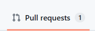
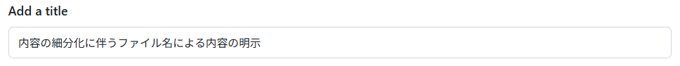
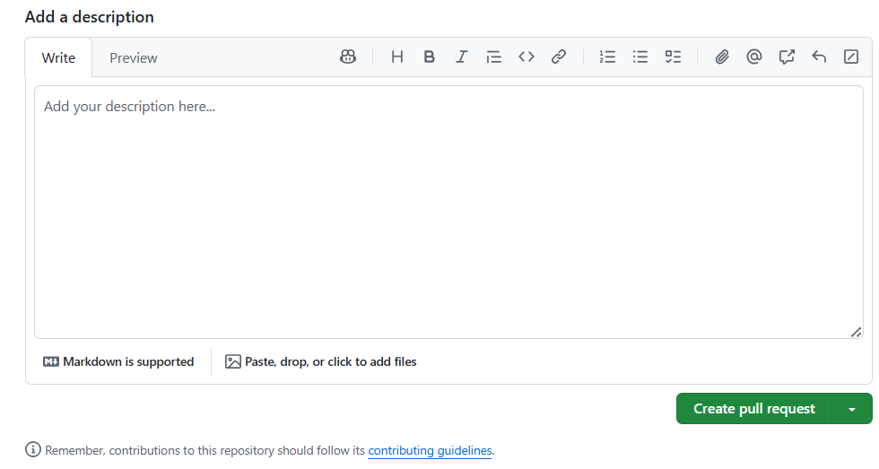
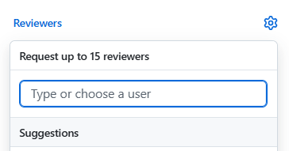
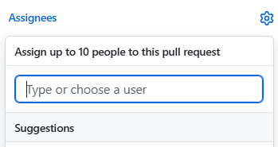

# PRの出し方とレビューの仕方

※これはあくまでプルリクエストの出し方とレビューの仕方のガイドラインであり、gitコマンドの使い方については [こちら](./github.md) を参照してください。

## PRの出し方

※これはgithubのページでの操作方法を説明するものです。

1.[Pull Requestページ](https://github.com/rikut0904/fish-tech/pulls)にアクセス

2.既にpushされている場合は「Compare & pull request」ボタンをクリック

3.タイトルと説明を入力

4.歯車を押してレビュワーを指定（最低1人以上）

5.Assigneesを押して自分を指定

## レビューの依頼

これらが完了したら、レビュワーに対して「レビューお願いします」といった内容のメッセージを送ってください。
